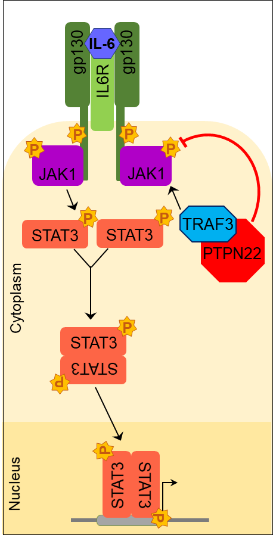

Emma Treco
HW 3 Revision
He
08 Apr 2023

# **Impact of Traf3 Copy Number on IL-6 Signaling**

Treco, E; Hornick, E; Bishop, G. The Bishop Lab. 2022-23

**Introduction**
High specificity and diversity are key features of adaptive immunity and are critical for protection against reinfection. Plasma cells (PCs) are fully differentiated B cells that are specifialized to constitutively produce a singular product: one specific, high-affinity antibody (note: PCs are different from memory B cells which are dormant). As such, PCs are major contributors to the afforementioned featues of adaptive immunity. After immature B cells with high-affinity B cell receptors differentiate into PCs, they are sustained by IL-6R signaling. IL-6 is also a growth factor for malignant PCs and therefore must be tightly regulated. Previous work from our laboratory has shown that the adaptor protein Tumor Necrosis Factor Receptor (TNFR)-Associated Factorr 3 (TRAF3) is an important negative regulator of IL-6R signaling in B cells (Figure 1). Upon IL-6 stimulation of the receptor, TRAF3 recruits phosphatase PTPN22 to the IL-6R signaling complex (Figure 1). PTPN22 reverses IL-6 dependent activation of JAK1 and STAT3 by removing the activating phosphorylation, which suppresses downstream effects such as PC development (Figure 1). B cells deficient in TRAF3 (knockouts) have increased IL-6 dependent phosphorylation of JAK1 and STAT3 as a reesult. Most of our work to date has been performed on B cells with a homozygous loss of *Traf3*, but further investigation of how *Traf3* copy number affects TRAF3-dependent phenotypes is justified based on:
1) an increasing number of patients with heterozygous loss-of-function *Traf3* mutations
2) preliminary work indicating B cells TRAF3 levels may decline with age
The goal of this project is to reproduce Figure 2 which shows that following IL-6 stimulation of B-*Traf3* heterozygous primary mouse cells, there is enhanced early STAT3 phosphorylation compared to wildtype mice (Figure 2).

**Materials and Methods**
Western blotting was used to determine the differences in the amount of protein produced by WT, hets, and KO. 
Figure 2 shows the pooled data from western blots asseessing the differences in the amount of STAT3 
phosphorylation in response to IL-6. The data I have is the quantification of the sizes of the bands in the 
western blots that I have ran and imaged over the last year. This data for 4-5 mice of each genotype has been 
added to my git repository as an excel spreadsheet. Data for additional mice will be added in the coming weeks. I 
also have a representative Western blot which will be included for reference. To create my target graph, I will 
be using the language R on RStudio. I will use R to organize the data in the optimal way and create means and 
standard deviations for each time point and genotype prior to creating the graph. The mean and standard deviation 
will be useful in determining potential outliers and in demonstrating the spread of the data on the graph. I also 
plan to use R to perform an ANOVA test on these data. This statistical analysis will be used to 
mark significant differences between wildtype and heterozygous mice, wildtype and knockout mice, and heterozygous 
and knockout mice. Following this processing of the data, I will be able to construct my graph in the same 
fashion as the model figure (Figure 2).
Up to now (April 08) the data of the female mice has been plotted onto a rudimentary graph using R. The data has 
been put on the correct axes and is labeled according to mouse genotype. Moving forward, the graph will show 
averages and standard error bars. There will also be a line connecting the genotypes. Lastly, the ANOVA test will 
be performed and the p-score will be reflected on the graph with asteriks (added based on feedback from HW2).

**Results**
Thus far the results have been separated by males and females, then the female datapoints have been plotted 
according to time point and colored according to genotype (Figure 3).

